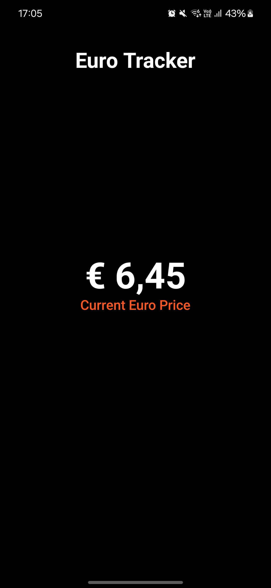

# 📱 Euro Tracker

Euro Tracker is a minimal Android app that shows the current Euro-to-BRL exchange rate. It fetches real-time data from [Frankfurter API](https://frankfurter.dev/) and displays it in a modern Compose UI. The app also sends a daily notification at noon with the current Euro rate.

## ✨ Features

* 📈 Real-time Euro-to-BRL conversion

* ⏰ Daily notifications at noon with the current rate

* 🌙 Dark-themed, modern Material 3 UI

## 📸 Screenshots



## 🚀 Getting Started

1. Clone the repository:
    ```bash
    git clone https://github.com/your-username/euro-tracker.git
    ```

2. Open in Android Studio

3. Run the app on an emulator or real device running (API 30+ required).

## 🛠️ Tech Stack

* Kotlin

* Jetpack Compose

* WorkManager

* Material 3

* Frankfurter API

## 🔒 License

This project is licensed under the *GNU General Public License v3.0* license.

📄 See the full license in LICENSE.


## 🙋 Contributing

Pull requests are welcome! If you have ideas to improve the project or learn from it, feel free to fork and explore.